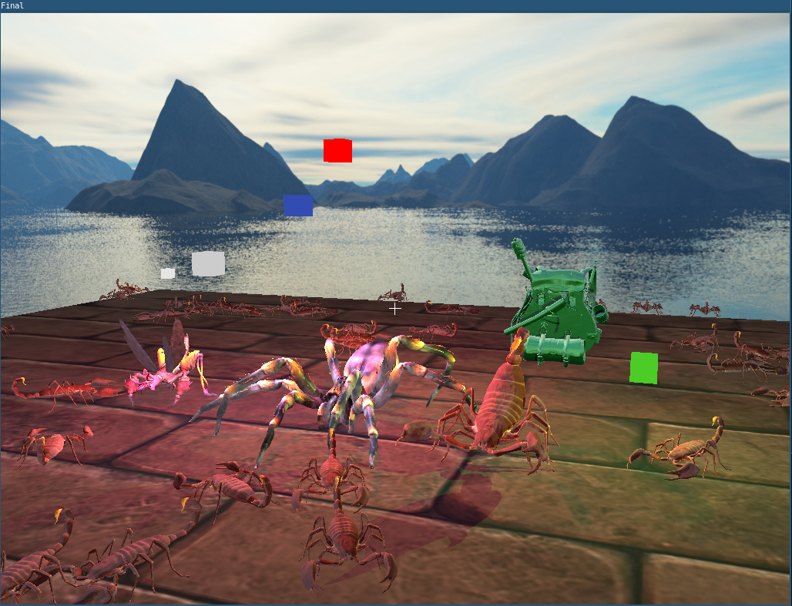
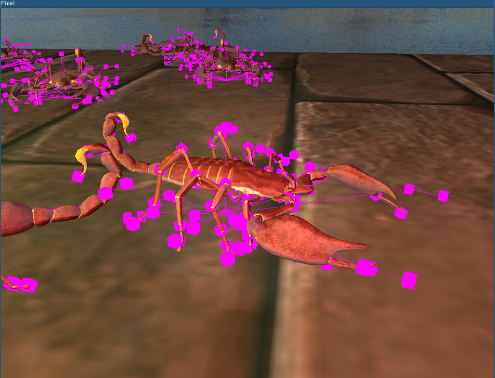

# Introduction

**Demo video: [https://youtu.be/5_nLU0k6Mxc](https://youtu.be/5_nLU0k6Mxc)**

Source code for this project is available at
[https://github.com/devplayer0/cs4052](https://github.com/devplayer0/cs4052).

Declaration: The work on both the programming and written assignments is
entirely my own and I have not collaborated with anyone.

## Features implemented

The following features have been implemented in the final project.

- First person camera
- Loading of Wavefront OBJ meshes
- Hierarchical objects (modelled by a standard skeletal rig)
- Skinned animation with linearly interpolated keyframes
- Phong lighting model (directional, point and spot lights)
- Materials and texture mapping (diffuse, specular, normal mapping, emmissive)
- Custom object file format which organises data for easier loading:
  - Multiple meshes
  - Joints (or bones) for skeletal hierarchy
  - Keyframes which operate on joints for skeletal animation
  - Materials (including textures)
- Crowd of skeletally animated (hierarchical) creatures
- Boids (for translating crowd members around the scene)
- Cubemap for skybox and environment mapping (reflections)
- Omnidirectional shadow mapping (point light shadows)

\newpage


# Implementation background

This project is written in Go. The reasons for this choice of language (over
C++) was the fact that it is generally a little easier to use and more modern.

Choosing Go has no real performance side effects; the language is perfectly fast
enough for an OpenGL application. No game engines or high-level rendering
libraries were used, so the actual implementation is quite similar.
[`go-gl`](https://github.com/go-gl) provides a number of useful libraries and
bindings used in this project:

- [GLFW 3 bindings](https://github.com/go-gl/glfw), 1:1 bindings
- [OpenGL bindings](https://github.com/go-gl/gl), 1:1 bindings - to follow Go
  conventions, any call, such as `glDrawElements()` or
  `glEnableVertexAttribArray()` become `gl.DrawElements()` and
  `gl.EnableVertexAttribArray()` respectively. Constants such as `GL_TEXTURE_2D`
  become `gl.TEXTURE_2D`
- [MathGL (pure Go maths library, similar to GLM)](https://github.com/go-gl/mathgl),
  _all MathGL features start with `mgl32`_

Aside from these libraries provided by the `go-gl` project, only the following
libraries were used:

- [`go-obj`](https://github.com/sheenobu/go-obj) - Wavefront OBJ parsing library
  for Go
- [Assimp](http://assimp.org/) - Model loading library, used in Python converter
  script to import external models in various formats
- [Python Pillow](https://pillow.readthedocs.io/en/stable/) - Image processing
  library for Python, used to load and convert textures to PNG
- [Go `image` package](https://golang.org/pkg/image/) - Simple standard library
  package for manipulating 2D images, used to load PNG and JPEG textures
- [Protocol buffers](https://developers.google.com/protocol-buffers/) - System
  for generating code that can read / write efficient custom file formats, used
  to save / load models in the custom file format developed for this project

# Basic abstractions

Since no high-level rendering libraries are used in this project, it's
necessary to abstract away some of the low-level OpenGL calls for cleaner code.
The following is a brief overview of what each of the basic abstractions
(created from scratch for this project) does.

## Buffer

The `Buffer` struct provides a stateful wrapper around OpenGL VBO's. A
`Buffer` can be filled with vertices using convenience methods which
accept `mgl32` values. It's also possible to set the pointer to vertex
data for a given `Program` struct (discussed later).

Example usage:

```go
CubeVertices := []mgl32.Vec3{
  {-1, -1, -1},
  {1, -1, -1},
    {1, 1, -1},
    /// ...
}

var vao uint32
gl.GenVertexArrays(1, &vao)
gl.BindVertexArray(vao)
cubeBuffer := NewBuffer(gl.ARRAY_BUFFER) // glGenBuffers()
cubeBuffer.Bind() // Equivalent to glBindBuffer()
cubeBuffer.SetVec3(CubeVertices) // Serializes the Vec3's and calls glBufferData()
// Does glGetAttribLocation(), glEnableVertexAttribArray() and glVertexAttribPointer()
cubeBuffer.LinkVertexPointer(cubeProg, "frag_pos", 3, gl.FLOAT, 0, 0)
```

Source file: [`pkg/util/buffer.go`](https://github.com/devplayer0/cs4052/blob/master/pkg/util/buffer.go)

## Shader

`Shader` provides convenience methods for compiling OpenGL shaders, such as
vertex, fragment or geometry
shaders, including loading source from file, accepting Go strings and
providing Go `error`s (which wrap the output from `glGetShaderInfoLog()`) when
compilation fails.

Support is provided (via `NewShaderTemplate()` and `NewShaderTemplateFile()`)
for generating source from Go's built-in templating language (useful for
parameters such as the number of lights, which is not known at application
compile time, but is known at shader compile time).

Example usage:

```go
// Calls glCreateShader() and glShaderSource()
v, err := NewShaderFile(gl.VERTEX_SHADER, vertex)
if err != nil {
    return fmt.Errorf("failed to load vertex shader: %w", err)
}
// Does glCompileShader() and uses glGetShaderiv() to check GL_COMPILE_STATUS
if err := v.Compile(); err != nil {
    return fmt.Errorf("failed to compile vertex shader: %w", err)
}
```

Source file: [`pkg/util/shader.go`](https://github.com/devplayer0/cs4052/blob/master/pkg/util/shader.go)

\newpage
## Program

`Program` is a wrapper around an OpenGL program object. Once created, it
can linked to provided `Shader` structs (vertex, fragment and optionally
geometry), again giving a high level error message.

A convenience method `LinkFiles()` allows for the loading from file, compiling
and linking of shaders in a single call (using the `Shader` abstractions).
Similar to `Buffer`, convenience methods are provided to set uniform
values with Go types. For example, `SetUniformVec3()` calls `glUniform3fv()`.

Example usage:

```go
shader := util.NewProgram()
if err := shader.LinkFiles("assets/shaders/crosshair.vs", "assets/shaders/white.fs", ""); err != nil {
	return nil, fmt.Errorf("failed to set up program: %w", err)
}
// ...
// Uses glGetUniformLocation() and glUniformMatrix4fv()
shader.SetUniformMat4("model", mgl32.Translate3D(w/2, h/2, 0).Mul4(mgl32.Scale3D(8, 8, 0)))
```

Source file: [`pkg/util/program.go`](https://github.com/devplayer0/cs4052/blob/master/pkg/util/program.go)

## Texture

`Texture` is a simple wrapper around an OpenGL texture. Aside from wrapping
calls such as `glBindTexture()` and `glTexParameteri()`, support (via Go's
standard library `image/png` and `image/jpeg` libraries) for decoding and
uploading PNG or JPEG image data (or loading it from file) is provided.

Example usage:

```go
// glGenTextures()
groundDiffuse := util.NewTexture(gl.TEXTURE_2D)
// Uses Go's `jpeg.Decode()` and `image.At()` to get raw pixel data and then
// calls glTexImage2D() to upload the pixels
if err := groundDiffuse.LoadJPEGFile(gl.TEXTURE_2D, "assets/textures/brickwall.jpg"); err != nil {
    return fmt.Errorf("failed to load ground texture: %w", err)
}
```

Source file: [`pkg/util/texture.go`](https://github.com/devplayer0/cs4052/blob/master/pkg/util/texture.go)

## Framebuffer

`Framebuffer` is a very simple wrapper around an OpenGL FBO. Aside from creation
and binding, which are 1:1 to OpenGL calls, `SetTexture()` does
`glFramebufferTexture()` using a provided `Texture` (abstraction) struct, simply
reading its ID.

```go
depthMaps := NewTexture(gl.TEXTURE_CUBE_MAP_ARRAY)
// ... texture setup

depthMapsFBO := NewFramebuffer(gl.FRAMEBUFFER)
depthMapsFBO.Bind() // glBindFramebuffer()
depthMapsFBO.SetTexture(gl.DEPTH_ATTACHMENT, DepthMaps, 0)
depthMapsFBO.Unbind() // glBindFramebuffer(..., 0)
```

Source file: [`pkg/util/framebuffer.go`](https://github.com/devplayer0/cs4052/blob/master/pkg/util/framebuffer.go)

\newpage
# Feature implementation details

This section describes in detail the design and implementation of all of the
features for the project.

## First person camera

`Camera` provides a game-style freelook first person camera. The interface allows
the program to set the camera's position with a `Vec3` and its rotation with a
`Vec2` (for left-right and up-down rotation respectively). Up-down rotation is
locked to 90 / -90 degrees as is standard in such cameras.

`MoveX()`, `MoveY()` and `MoveZ()` allow the camera to be moved by a
given delta value, with `MoveX()` and `MoveZ()` acting relative to the
camera's current rotation. If `lockY` is set, moving on the `Z` axis
will be limited to the horizontal plane only (common in games).

Finally, the `Transform()` provides access to the transform matrix for
drawing. In the main application, the WASD keys control the horizontal
movement of the camera and the spacebar / C keys control vertical movement
respectively.

Source file: [`pkg/util/camera.go`](https://github.com/devplayer0/cs4052/blob/master/pkg/util/camera.go)

## Mesh

`Mesh` is a struct which handles uploading and the CPU-side of rendering a mesh
(including setting up materials with textures). Skinning data (vertex weights)
can optionally be provided for use with skeletal animation. Meshes represented
by this struct always use a set of vertex objects referenced by and index array
(for indexed drawing).

A mesh object is represented by the following struct definition:

```go
// Mesh represents a mesh (indices, vertices and optional UV's and skinning)
type Mesh struct {
    Indices  []uint32
    Vertices []Vertex
    Weights  []JointWeights

    Material *Material

    VAO          uint32
    DepthVAO     uint32
    indexBuffer  *util.Buffer
    vertexBuffer *util.Buffer
    skinBuffer   *util.Buffer
}
```

The `Vertex` struct is defined as follows (uploaded directly to the GPU):

```go
// Vertex represents a vertex in a mesh (position, normal and UV coordinates)
type Vertex struct {
    Position  mgl32.Vec3
    Normal    mgl32.Vec3
    UV        mgl32.Vec2
    Tangent   mgl32.Vec3
    Bitangent mgl32.Vec3
}
```

\newpage
### Setup

Upon creation (with provided mesh data and a material), the `Mesh` object does
the following (from the `init()` function):

1. Generate and bind the main VAO (`glGenVertexArrays()`)
2. Create vertex buffers (using the `Buffer` abstraction ) for vertex indices,
   vertex data and optionally skinning data (skinning explained in detail later).
3. Create and bind second VAO (for rendering to the depth map) and bind each of
   the above VBO's

The user of the `Mesh` would then call `Upload()` with a provided shader
(`Program`). This does the following:

1. Serialize and upload the index, vertex and skinning data to the respective
   buffers
2. Use `Buffer`'s `LinkVertexPointer()` to point each attribute in the vertex struct
   at the correct offset, and optionally do the same for skinning data

The user can also call `LinkDepthMap()` with a depth map shader to call
`LinkVertexPointer()` for only the vertex attributes needed to render the depth
map.

### Mesh loading

While `Mesh` is primarily concerned with the management of the OpenGL objects
needed to draw a mesh with an appropriate shader, code is provided to translate
user-provided mesh data to the format that is uploaded to the GPU.

For the mid-term project, only Wavefront meshes were supported. This code
remains, using `go-obj` to parse the data and reading in vertices, normals,
texture coordinates and indices.

The final project primarily uses a custom file format (described in detail later).
While the file itself is loaded by a different object, `Mesh` does a bit of
translation to get the data ready for upload to the GPU. Vertices (made up of
all the fields describe in the `Vertex` struct) and indices are 1:1. The
input map of joint ID's to a list of pairs (vertex ID's and a weight value),
while space-efficient, needs to be translated into a list of fixed-size arrays
indexed by vertex. These arrays' elements are joint ID's and weight values, used
in the skinning vertex shader to perform skinning (with joint transforms). This
is explained in more detail later!

### Rendering

Once the mesh has been loaded and set up, rendering can be performed. `Mesh`
provides two rendering functions: `Draw()` (for regular rendering with texturing,
material properties and lighting) and `DepthMapPass()` which is used only for
generating the depth maps for shadows.

Materials are described later, but once the appropriate textures (and / or
uniforms) are set up (or not at all in the `DepthMapPass()` case), the mesh is
drawn as follows:

1. The appropriate (for regular or depth map drawing) vertex array is bound
2. If wireframe mode is active, `glPolygonMode()` is called with `GL_LINE`
3. `glDrawElements()` is called to draw the mesh
4. `glPolygonMode()` is called with `GL_FILL`

Source file: [`pkg/object/mesh.go`](https://github.com/devplayer0/cs4052/blob/master/pkg/object/mesh.go)

\newpage
## Hierarchical objects

The hierarchy system from the midterm was re-written to support externally
produced models with their own rigging and keyframes.

`Object` implements a hierarchical object (the hierarchy is represented by
a rig made up of bones, which is later used for keyframed animation) which can
be made up of a number of meshes (`Mesh` objects).

An `Object` consists of:

- Drawing and depth map shaders
- A set of materials (referenced by one or more meshes)
- A hierarchy (or skeleton, represented as a tree of joints)
- A set of keyframed animations
- A list of mesh instances (combination of a referenced mesh and a transformation)
- An optional debug shader for drawing the skeleton and joints

All of this data is extracted from a loaded custom object file (explained later).

### Setup

Upon creation, an `Object` takes a parsed protobuf SOBJ `Object` (in a
friendly set of Go structs).

1. Each material is converted into a `Mesh`'s material with `LoadSOBJMaterial()`
   (also handles decoding of embedded PNG textures)
2. Each mesh is converted into a `Mesh` object, provided with a material (from
   the list assembled in the previous step) and the buffers are filled and linked
   to the shaders provided to the `Object` (normal and depth map)
3. `buildNodeHierarchy()` is called to recursively build up the hierarchy as a
   tree from the flat representation with index references
4. If debugging is enabled, VAO's and buffers will be created to render cubes
   for each node, and a line to the parent node

\newpage
#### Building the hierarchy



Each node in the tree does not necessarily represent a joint (this is due to the
way Assimp works, where the nodes come from), but each node must be kept in the
tree as it may hold a transform which must be applied to properly position the
skeleton.

`buildNodeHierarchy()` will read the joint information into the tree if present
at the current node. All of the animations will also be iterated over. If an
animation has a "channel" for this node, the position, rotation and scaling
keyframes will be read in.

Following these steps, `buildNodeHierarchy()` is called then for each child,
with pointers to wire up parents and children in each node.

### Skinning

Skinning is the process of attaching the meshes vertices to the skeleton. This
means transforming each vertex by matrices calculated at each joint. A vertex's
final position can be influenced by a number of different joints, and each can
have a different "weight" (amount of influence).

The `Object` `Update()` function is responsible for calculating the final
transform for a given joint on every frame. These transforms are then passed
as a uniform value to the vertex shader for each mesh in the object. Recursively
the hierarchy is traversed, with each node's transform being applied to the
parent's to produce a final transformation at that node. If a joint is present
at the node, the final transformation is multiplied by that joint's inverse
bind matrix (this important step brings the transformation for vertices into
joint space) and set in the array to be sent to the vertex shader.

\newpage
In the vertex shader, the transformations for joints which hold weight over the
current vertex are applied:

```glsl
in ivec4 joint_ids_a;
in ivec4 joint_ids_b;
in vec4 weights_a;
in vec4 weights_b;

// ...

uniform mat4 joints[MAX_JOINTS];

void main() {
    mat4 skinning  = joints[joint_ids_a[0]] * weights_a[0];
         skinning += joints[joint_ids_a[1]] * weights_a[1];
         skinning += joints[joint_ids_a[2]] * weights_a[2];
         skinning += joints[joint_ids_a[3]] * weights_a[3];
         skinning += joints[joint_ids_b[0]] * weights_b[0];
         skinning += joints[joint_ids_b[1]] * weights_b[1];
         skinning += joints[joint_ids_b[2]] * weights_b[2];
         skinning += joints[joint_ids_b[3]] * weights_b[3];

    // ...

    gl_Position = projection * camera * model * skinning * vec4(frag_pos, 1.0);
```

Note the `joint_ids_*` vectors (and corresponding `weights_*`) which give
indices into the `joints` uniform and allow for up to 8 joints to influence a
vertex (an `(i)vec4` is the largest type that works for this purpose as a
vertex attribute).

`DepthMapPass()` and `Draw()` call the corresponding methods in `Mesh` to render
each instance of each mesh in the object with the `joints` uniform set. If
debugging is enabled, `Draw()` will also render an overlay of the skeleton's
current pose.

### Animation

Animation, as mentioned in passing above, acts on a node in the hierarchy.
`Update()` takes an animation and time parameter. The `node` `traverse()` helper
function (used in `Update()`) checks if the provided animation acts on the
current node. If so, it uses a linearly interpolated value for position,
rotation (quaternion spherical linear interpolation in that case) and scale
keyframes based on the time instead of that node's static transform.

Source file: [`pkg/object/mesh.go`](https://github.com/devplayer0/cs4052/blob/master/pkg/object/object.go)

## Lighting

This project provides an abstraction of directional, point and spot light
objects (attached to a `Lighting` struct) to light objects with a Phong model.

`DirectionalLight`, `Lamp` and `Spotlight` structs provide values for the
ambient, diffuse and specular components of lighting. A `DirectionalLight` has
a vector for its direction, a `Lamp` has a vector representing its position
and a `Spotlight` has an inner and outer cutoff (blurring in between).

Changes to each of these structs (since they are pointers) can be made, and then
the uniform values can be updated with a simple call to `Update()`.
Cubes representing the in-world position of point lights can be rendered with
their diffuse colour via the `DrawCubes()` function.

Source file: [`pkg/util/lighting.go`](https://github.com/devplayer0/cs4052/blob/master/pkg/util/lighting.go)

### Shader

[`assets/shaders/lighting.fs`](https://github.com/devplayer0/cs4052/blob/master/assets/shaders/lighting.fs)
is the master lighting shader, used for all colour calculations (Phong lighting,
materials, texturing, environment mapping, shadows). This shader's source is run
through the Go template engine at `Lighting` initialization time (to supply the
number of directional, point and spot lights).

Each type of colouring is effectively split out into its own function, with the
results added together to produce the final fragment colour. The light objects
are provided as uniforms (set in the `Lighting.Update()` function).

#### Phong calculations

While there is a dedicated function for each type of light, the calculations for
each are mostly the same (with some specifics for each type). Below is the GLSL
code for calculating the value for a directional light:

```glsl
vec3 dir_phong(dir l, vec3 normal, vec3 view_dir) {
    vec3 light_dir = normalize(-l.direction);

    // diffuse
    float diffuse = max(dot(normal, light_dir), 0.0);

    // specular
    vec3 reflect_dir = reflect(-light_dir, normal);
    float specular = pow(max(dot(view_dir, reflect_dir), 0.0), m_shininess);

    vec3 result;
    result += l.ambient * diffuse_color();
    result += l.diffuse * diffuse * diffuse_color();
    result += l.specular * specular * specular_color();

    return result;
}
```

Note the calculation and addition of each component. `m_*` variables are
material uniforms (such as the shininess exponent used for specular calculation).
The `*_color()` functions are explained in the materials section. Attenuation
parameters are used in the specular calculation for point and spot lights (see
the full fragment shader source).

A for-loop in the shader's `main()` iterates over each type of lamp and calls
the corresponding function to get the colour for that lamp.

```glsl
vec3 result;

for (int i = 0; i < N_DIRS; i++) {
    result += dir_phong(dirs[i], normal, view_dir);
}
for (int i = 0; i < N_LAMPS; i++) {
    lamp l = lamps[i];

    // ...
    result += lamp_phong(i, l, lamp_pos, pos, normal, view_dir);
}

// ...

result += emmissive_color();
result += env_reflections(pos, normal, view_dir);

// ...

out_color = vec4(result, 1.0);
```

\newpage
## Materials and texture mapping

Rich materials are supported in this project, implemented in `Mesh` and the
main lighting shader. Supported attributes are:

- Diffuse color: Used with ambient and diffuse lighting, either statically
  defined or sampled from a texture
- Specular color: Used for specular calculations, either static or sampled
  from a texture
- Normal mapping: Increases lighting fidelity by using a texture to sample
  normals per-fragment instead of per-face
- Emmissive color: Purely additive (ignoring any lighting factors), either static
  or sampled from a texture
- Shininess: The exponent used in specular calculations
- Reflectiveness: A factor multiplied by the color obtained from the reflection
  value before adding it to the final colour

### Setup

In `Mesh`, a `Material` struct exists, representing all of the above:

```go
type Material struct {
	Diffuse   mgl32.Vec3
	Specular  mgl32.Vec3
	Emmissive mgl32.Vec3

	DiffuseTexture   *util.Texture
	SpecularTexture  *util.Texture
	NormalTexture    *util.Texture
	EmmissiveTexture *util.Texture

	Shininess      float32
	Reflectiveness float32
}
```

In regular rendering, either the static values (for diffuse, specular or
emmissive), or texture units are set before drawing, (along with uniforms for
shininess and reflectiveness). Static values are used (uniforms) when no texture
is provided.

### Rendering

In the main lighting shader, `*_color()` functions either return a value sampled
from the appropriate texture (e.g. diffuse), or return the value of the
appropriate uniform.

#### Normal mapping

Normal mapping, when enabled, uses normals in tangent space calculated in the
vertex shader as follows:

```glsl
in vec3 tangent;
in vec3 bitangent;

// ...

mat3 normal_matrix = transpose(inverse(mat3(model)));
if (normal_map) {
    vec3 T = normalize(normal_matrix * tangent);
    vec3 N = normalize(normal_matrix * normal);
    T = normalize(T - dot(T, N) * N);
    vec3 B = cross(N, T);
    TBN = transpose(mat3(T, B, N));
} else {
    world_normal = normalize(normal_matrix * normal);
}
```

Full vertex shader: [`assets/shaders/mesh_skinned.vs`](https://github.com/devplayer0/cs4052/blob/master/assets/shaders/mesh_skinned.vs)

\newpage
At the fragment stage, abstractions are used to calculated values needed for
lighting in the correct space (whether normal mapping is performed or not):

```glsl
vec3 pos, normal, view_dir;

if (normal_map) {
    pos = TBN * world_pos;
    normal = normalize(texture(tex_normal, uv).rgb * 2.0 - 1.0);
    view_dir = normalize(TBN * view_pos - pos);
} else {
    pos = world_pos;
    normal = world_normal;
    view_dir = normalize(view_pos - pos);
}
```

[`assets/shaders/lighting.fs`](https://github.com/devplayer0/cs4052/blob/master/assets/shaders/lighting.fs)

## Custom object file format

The main reason a custom object file format (`SOBJ` or "super-object") was
created for this project is due to the lack of Assimp bindings for Go. Faster
load times (since conversion and extra calculations such as tangent space) along
with easy loading are added benefits.

SOBJ is a protocol buffer (definition:
[`converter/object.proto`](https://github.com/devplayer0/cs4052/blob/master/converter/object.proto)),
which makes saving and loading easy via libraries provided by Google. In order
to generate SOBJ files, a Python converter script is used. Python was chosen as
it is a quick and easy language to write (its poor performance is not an issue
for one-time conversions), as well as the fact that it has official Assimp
bindings.

With the following line, Assimp is invoked to read a model from standard input
(e.g. using a Unix pipe):

```python
with pyassimp.load(sys.stdin.buffer, file_type=sys.argv[1], processing=
        aiProcess_Triangulate           |
        aiProcess_JoinIdenticalVertices |
        aiProcess_GenSmoothNormals      |
        aiProcess_SortByPType           |
        aiProcess_FlipUVs               |
        aiProcess_CalcTangentSpace
    ) as scene:
```

Note the use of Assimp post-processing flags, some of which would be quite
expensive at runtime.

The `Converter` class in the script takes the Assimp scene object and fills in
all of the fields in the `Object` protobuf (reading meshes, skeletal hierarchy,
skinning data, animations). All textures will be read and converted to PNG
format and written to the protobuf, so that an object is fully self-contained
in a single file.

Converter script source: [`converter/convert.py`](https://github.com/devplayer0/cs4052/blob/master/converter/convert.py)

## Crowd of skeletally animated creatures

By simply drawing an `Object` many times (64 in this case), a crowd of
hierarchical creatures is formed. To translate them around the scene, boids
are used.

## Boids

Boids provide a relatively simple way to simulate the movement of a flock of
creatures, through the use of rules which govern movement. The main rules are:

- Cohesion: Boids steer towards the "centre of mass" of other boids in the
  vicinity, essentially "average position"
- Alignment: Boids steer towards the average heading of other boids in the
  vicinity, basically "average velocity"
- Separation: Boids steer away from other boids which are very close

These rules are implemented in [`pkg/object/boids.go`](https://github.com/devplayer0/cs4052/blob/master/pkg/object/boids.go).

## Cubemap

A cubemap is a 3D texture represented by a cube. Each face of the cube is
textured by a single image. The texture can then be sampled with a direction
vector, which makes implementing features like a skybox (simulation of a
far away surrounding environment) and simple reflections quite easy.

### Skybox

[`pkg/util/skybox.go`](https://github.com/devplayer0/cs4052/blob/master/pkg/util/skybox.go)
implements the CPU side (creating the cubemap texture and drawing it) of the
skybox. Six individual JPEG textures are loaded into the cubemap texture
(using `Texture.SetData()`, basically `glTexImage2D()`) with the appropriate
`GL_TEXTURE_CUBE_MAP_*` constant.

When drawing, the camera's translation is discarded (so the skybox doesn't move).

The following simple shaders (vertex and fragment) handle drawing of the skybox:

```glsl
in vec3 frag_pos;

out vec3 tex_coords;

uniform mat4 projection, camera;

void main() {
    tex_coords = frag_pos;
    vec4 pos = projection * camera * vec4(frag_pos, 1);
    // Always fail the depth test if there's something else to be rendered
    gl_Position = pos.xyww;
}
```

```glsl
in vec3 tex_coords;

out vec4 out_color;

layout(binding = 0) uniform samplerCube skybox;

void main() {
    out_color = texture(skybox, tex_coords);
}
```

### Reflections

By passing the `samplerCube` into the main lighting shader, it's easy to
calculate a reflection vector about the normal and sample the cubemap to produce
reflections from the environment.

```glsl
layout(binding = 4) uniform samplerCube env_map;

// ...

vec3 env_reflections(vec3 pos, vec3 normal, vec3 view_dir) {
    vec3 r = reflect(-view_dir, normal);
    return texture(env_map, r).rgb * m_reflectiveness;
}

void main() {
    // ...
    result += env_reflections(pos, normal, view_dir);
    // ...
}
```

\newpage
## Omnidirectional shadow mapping

In order to render shadows from light sources, a depth map is used. This depth
map is a texture whose values represent how far a fragment is from a point,
in this case, a given light source. Using the depth map it is possible to
determine whether a fragment is in shadow by checking if the current fragment's
depth is greater than the closest fragment's (obtained from the depth map).

For a point light, light is omnidirectional, so a simple 2D depth map cannot be
used. A cubemap can be used instead, since it is sampled with a 3D vector. In
this case, a geometry shader is used to emit a triangle for each face of the
cube (appropriate transformations are generated on the CPU).

In order to support more than one point light, a cubemap array texture is used.
This allows a depth map to be generate from every light's perspective.
This array of cubemaps is represented as a 1-dimensional array, where every 6
layers are a single cubemap.

In [`pkg/util/lighting.go`](https://github.com/devplayer0/cs4052/blob/master/pkg/util/lighting.go),
`initDepthMaps()` generates the cubemap array (using `GL_TEXTURE_CUBE_MAP_ARRAY`)
and `Texture.SetData3D()` (wrapper for `glTexImage3D()`).

At this point, a framebuffer is generated and the cubemap array is attached to
its depth component. The framebuffer allows the depth map to be rendered to the
texture instead of the viewport. Later, the texture can be sampled within the
main lighting shader.

A simple vertex shader passes the vertices straight through to the geometry
stage (applying skinning if operating on a skeletally-animated mesh). The
following geometry shader is used to generate a triangle for every face of the
cubemap (for each point light!).

```glsl
layout (triangles) in;
layout (triangle_strip, max_vertices={{mul 6 3 (len .Lamps)}}) out;

// Only emit geometry for lamps we actually need to update
uniform bool update_lamps[N_LAMPS];
// Set of transforms for each lamp (one for each face of the cubemap)
uniform mat4 shadow_transforms[N_LAMPS*6];

out vec4 frag_pos; // frag_pos from GS (output per emitvertex)

void main() {
    for (int lamp = 0; lamp < N_LAMPS; lamp++) {
        if (!update_lamps[lamp]) {
            continue;
        }

        for (int face = 0; face < 6; face++) {
            // We're using a cubemap array - each layer is a single face of an
            // element in the array
            gl_Layer = lamp*6 + face;
            // for each triangle's vertices
            for (int i = 0; i < 3; i++) {
                frag_pos = gl_in[i].gl_Position;
                gl_Position = shadow_transforms[lamp*6 + face] * frag_pos;

                EmitVertex();
            }

            EndPrimitive();
        }
    }
}
```

\newpage
Once the geometry has been generated, the fragment shader uses `gl_Layer` to
determine which lamp is being referred to and writes the depth component.

```glsl
in vec4 frag_pos;

#define N_LAMPS {{len .Lamps}}
uniform vec3 lamp_positions[N_LAMPS];
uniform float far_plane;

void main() {
    // gl_Layer represents the current face of the current cubemap array element
    // Divide by 6 to get the lamp index
    vec3 lamp_pos = lamp_positions[gl_Layer / 6];
    float lamp_distance = length(frag_pos.xyz - lamp_pos);

    // map to [0;1] range by dividing by far_plane
    lamp_distance /= far_plane;

    // write this as modified depth
    gl_FragDepth = lamp_distance;
}
```

The depth maps are drawn in the "depth pass", by `ShadowsDepthPass()` in the
`Lighting` struct. Here the viewport is modified to a square of the shadow
resolution and the framebuffer is bound. This function takes a callback argument
which is called to do the actual drawing (this is where the `Mesh` `DepthMapPass`
function is used!).

A `Lighting` function `UpdateLampI()` is used to update a point light. Note that
this is separate from the overall `Update()` function, since re-calculating the
depth map for a given light is very expensive! This function calculates the
perspective projections from the lights position, looking at the appropriate
cubemap face:

```go
// Calculate transforms for each face of the cubemap
shadowProj := mgl32.Perspective(mgl32.DegToRad(90), 1, nearPlane, farPlane)
lp := lamp.Position
ts := l.lampShadowTransforms

ts[index*6+0] = shadowProj.Mul4(mgl32.LookAtV(lp, lp.Add(mgl32.Vec3{1, 0, 0}), mgl32.Vec3{0, -1, 0}))
ts[index*6+1] = shadowProj.Mul4(mgl32.LookAtV(lp, lp.Add(mgl32.Vec3{-1, 0, 0}), mgl32.Vec3{0, -1, 0}))
ts[index*6+2] = shadowProj.Mul4(mgl32.LookAtV(lp, lp.Add(mgl32.Vec3{0, 1, 0}), mgl32.Vec3{0, 0, 1}))
ts[index*6+3] = shadowProj.Mul4(mgl32.LookAtV(lp, lp.Add(mgl32.Vec3{0, -1, 0}), mgl32.Vec3{0, 0, -1}))
ts[index*6+4] = shadowProj.Mul4(mgl32.LookAtV(lp, lp.Add(mgl32.Vec3{0, 0, 1}), mgl32.Vec3{0, -1, 0}))
ts[index*6+5] = shadowProj.Mul4(mgl32.LookAtV(lp, lp.Add(mgl32.Vec3{0, 0, -1}), mgl32.Vec3{0, -1, 0}))

l.depthUpdateLamps[index] = true
```

The `depthUpdateLamps` array of booleans is set as a uniform, which allows the
geometry shader to skip over lamps which haven't changed on a given frame. (All
of these booleans are reset to `false` at the end of `ShadowsDepthPass()`).

\newpage
In the main lighting shader, the following function performs the shadow
calculation:

```glsl
layout(binding = 5) uniform samplerCubeArray depth_maps;

// ...

float lamp_shadow(int index, vec3 lamp_pos, vec3 pos) {
    if (!shadows_enabled) {
        return 0.0;
    }

    vec3 frag_to_lamp = world_pos - lamp_pos;
    float closest_depth = texture(depth_maps, vec4(frag_to_lamp, index)).r;
    closest_depth *= far_plane;

    float current_depth = length(frag_to_lamp);
    float bias = 0.1;
    return current_depth - bias > closest_depth ? 1.0 : 0.0;
}
```

Note the sampling of `depth_maps` with a `vec4`, where the last element is the
cubemap index (aka lamp index). The shadow value is then incorporated into the
diffuse and specular components of the lamp lighting:

```glsl
vec3 lamp_phong(int index, lamp l, vec3 lamp_pos, vec3 pos, vec3 normal, vec3 view_dir) {
    // ...

    float shadow_factor = 1.0 - lamp_shadow(index, l.position, pos);

    vec3 result;
    result += l.ambient * diffuse_color() * attenuation;
    result += l.diffuse * diffuse * diffuse_color() * shadow_factor * attenuation;
    result += l.specular * specular * specular_color() * shadow_factor * attenuation;

    return result;
}
```

## Models used

- Scorpion: https://sketchfab.com/3d-models/scorpion-4c0fd62d33ab4d2592ee0a1d985a480d
- Tarantula: https://sketchfab.com/3d-models/tarantulamotions-485197d2755c4a0da0e1d82a2e258404
- Locust: https://sketchfab.com/3d-models/locust-monstermotions-3a882b94bad542d2be9d063889193854

Note: Unfortunately due to the complexity of rigging in many different file
formats (as well as Assimp's somewhat lackluster documentation!), I was unable
to get animation to work correctly for the tarantula and locust models.
