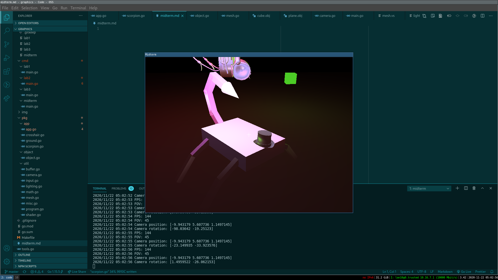
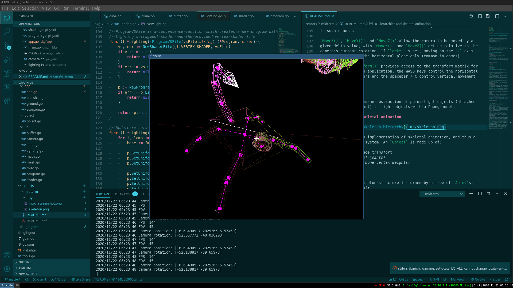

# Introduction

**Demo video: [https://www.youtube.com/watch?v=xc-p6N0kDgM](https://www.youtube.com/watch?v=xc-p6N0kDgM)**

Source code for this project is available at
[https://github.com/devplayer0/cs4052](https://github.com/devplayer0/cs4052).

At this stage, the project is able to:

- Provide a relatively powerful first person camera
- Load and render Wavefront OBJ meshes (currently without textures)
- Light meshes (and other components) with a dynamic number of point lights
  a Phong lighting model
- Model hierarchies by defining a skeleton
- Attach meshes to the skeleton
- Animate skeletons with linearly interpolated keyframes



# Implementation background

This project is written in Go. The reasons for this choice of language (over
C++) was the fact that it is more familiar and more modern.

Choosing Go has no real side effects; the language is perfectly fast enough for
an OpenGL application. No game engines or high-level rendering libraries were
used, so the actual implementation is quite similar.
[`go-gl`](https://github.com/go-gl) provides a number of useful libraries and
bindings used in this project:

- [GLFW 3 bindings](https://github.com/go-gl/glfw)
- [OpenGL bindings](https://github.com/go-gl/gl)
- [MathGL (pure Go maths library, similar to GLM)](https://github.com/go-gl/mathgl)

# Basic abstractions

To provide a higher level layer over raw OpenGL, a number of
abstractions were created.

## Buffer

The `Buffer` struct provides a stateful wrapper around OpenGL VBO's. A
`Buffer` can be filled with vertices using convenience methods which
accept `mgl32` values. It's also possible to set the pointer to vertex
data for a given `Program` struct (discussed later).

Example usage:

```go
CubeVertices := []mgl32.Vec3{
  {-1, -1, -1},
  {1, -1, -1},
    {1, 1, -1},
    /// ...
}

var vao uint32
gl.GenVertexArrays(1, &vao)
gl.BindVertexArray(vao)
cubeBuffer := NewBuffer(gl.ARRAY_BUFFER)
cubeBuffer.Bind()
cubeBuffer.SetVec3(CubeVertices)
cubeBuffer.LinkVertexPointer(cubeProg, "frag_pos", 3, gl.FLOAT, 0, 0)
```

## Shader

`Shader` provides convenience methods for compiling vertex / fragment
shaders, including loading source from file, accepting Go strings and
providing Go `error`s when compilation fails.

## Program

`Program` is a wrapper around an OpenGL program object. Once created, it
can linked to provided `Shader` structs (vertex and fragment), again
giving a high level error message.

Similar to `Buffer`, convenience methods are provided to set uniform
values with Go types.

## Mesh

`Mesh` allows for a 3D mesh to be loaded and drawn from a Wavefront
`.obj` file. The [`go-obj`](https://github.com/sheenobu/go-obj)
library is used to parse files.

Once all indices, vertices, normals and texture coordinates have been
loaded, they can be uploaded to a given `Program` using the `Buffer`
methods mentioned above.

# First person camera

`Camera` provides a game-style first person camera. The interface allows
the program to set the position with a `Vec3` and its rotation with a
`Vec2`. Up-down rotation is locked to 90 / -90 degrees as is standard
in such cameras.

`MoveX()`, `MoveY()` and `MoveZ()` allow the camera to be moved by a
given delta value, with `MoveX()` and `MoveZ()` acting relative to the
camera's current rotation. If `lockY` is set, moving on the `Z` axis
will be limited to the horizontal plane only (common in games).

Finally, the `Transform()` provides access to the transform matrix for
drawing. In the main application, the WASD keys control the horizontal
movement of the camera and the spacebar / C control vertical movement
respectively.

# Lighting

This project provides an abstraction of point light objects (attached
to a `Lighting` struct) to light objects with a Phong model. Each `Lamp`
struct represents a point light with position, ambient, diffuse and
specular lighting values. These are set on the lighting fragment shader.

Chanes to `Lamp`s (since they are pointers) can be made, and then the
uniform values can be updated with a simple call to `Update()`.
Cubes can be rendered with the diffuse colour at the lamp positions with
the `DrawCubes()` function.

\newpage
# Hierarchies and skeletal animation



`Object` provides an implementation of skeletal animation, and thus a
strong hierarchical system. An `Object` is made up of:

- A global world-space transform
- A skeleton (tree of joints)
- Meshes (and their bone vertex weights)

## Skeleton

The hierarchical skeleton structure is formed by a tree of `Joint`s.
A `Joint` consists of:

- At least one local transform (more for animation)
- A number of children
- An optional debugging VAO and buffers for rendering each joint and
  connections between joints (aka bones)

The `Draw` function on a `Joint` recursively calculates final world-space
transforms for the skeleton. With the root node, the caller passes the
overall world transform. The `Joint` then applies its local transform
(including animation) and calls the provided callback to inform the
caller of the value for the joint's final world-space transform. Finally,
the `Joint` calls `Draw` on all of its children with its final transform
as the input (establishing the hierarchy).

## Animation

Animation uses a relatively simple keyframe model with linear
interpolation. If more than one keyframe transform is provided for
a joint, the skeleton's `Draw` will interpolate the local transform
between the current and next keyframe. This is based on a provided
always increasing time value (each whole number is a full cycle
through the keyframes).

## Meshes and skinning

In order to actually render the animation, skinning needs to be applied
to the meshes in the `Object`. Each mesh has a `Mesh` object (loaded
from a Wavefront OBJ file) and a map of bone paths to vertex weights.
These weights are used in the skinning process to translate the mesh into
place.

The `Draw()` function on the `Object` is responsible for calling into the
root `Joint` to calculate all of the world-space transforms, it stores
these in a `map` of path strings which hierarchical of the form
`root.parent.child`, accessed later when skinning. If debugging is
enabled, each joint will have a small cube and a line to each of its
children drawn at this point.

Once all of the world transforms are stored in the flat `map`, each
mesh's vertices are skinned. Each key in the mesh's `VertexWeights`
`map` corresponds to one of the flattened `Joint` map's transforms.
Each vertex in the mesh then has all of its bone influences applied
(multiplying the vertex by the `Object`-local joint matrix, since the
`Object`'s world-space transform is applied later when drawing).

With the new vertex data calculated, it is-reupload to the VBO on the
mesh before being drawn with the provided shader.

## Issues

The main issue with the current `Object` is the lack of possibility to
import external rigging and animation data. `.obj` only provides vertex
data for a single mesh. An improvement for the next iteration of the
project might be to support loading a file format such as
[COLLADA](https://www.khronos.org/collada/), which can contain all of the
required data. It is also well-supported by many 3D programs, such as
Blender.

The main reason for the simplified animation is this lack of support for
external files! Rigging data had to be defined by hand! For example, the
provided sample "scorpion" looks like this (totals about 300 lines):

```go
obj := object.NewObject(&object.Joint{
  Keyframes: []mgl32.Mat4{
    mgl32.Ident4(),
  },
  Children: map[string]*object.Joint{
    "hat": {
      Keyframes: []mgl32.Mat4{
        mgl32.Translate3D(0, 0.3, -1.3).Mul4(mgl32.HomogRotate3DZ(mgl32.DegToRad(5))),
        mgl32.Translate3D(0, 0.3, -1.3),
        mgl32.Translate3D(0, 0.3, -1.3).Mul4(mgl32.HomogRotate3DZ(mgl32.DegToRad(-5))),
        mgl32.Translate3D(0, 0.3, -1.3),
        mgl32.Translate3D(0, 0.3, -1.3).Mul4(mgl32.HomogRotate3DZ(mgl32.DegToRad(5))),
      },
    },

    "stinger": {
      Keyframes: []mgl32.Mat4{
        mgl32.Translate3D(0, 0, 1.3).Mul4(mgl32.HomogRotate3DX(mgl32.DegToRad(50))),
        mgl32.Translate3D(0, 0, 1.3).Mul4(mgl32.HomogRotate3DX(mgl32.DegToRad(55))).Mul4(mgl32.HomogRotate3DY(mgl32.DegToRad(5))),
        mgl32.Translate3D(0, 0, 1.3).Mul4(mgl32.HomogRotate3DX(mgl32.DegToRad(60))),
        mgl32.Translate3D(0, 0, 1.3).Mul4(mgl32.HomogRotate3DX(mgl32.DegToRad(55))).Mul4(mgl32.HomogRotate3DY(mgl32.DegToRad(-5))),
        mgl32.Translate3D(0, 0, 1.3).Mul4(mgl32.HomogRotate3DX(mgl32.DegToRad(50))),
      },
      Children: map[string]*object.Joint{
        "end": {
          Keyframes: []mgl32.Mat4{
            mgl32.Translate3D(0, 1, 0),
          },
          Children: map[string]*object.Joint{
            "seg": {
              Keyframes: []mgl32.Mat4{
                mgl32.HomogRotate3DX(mgl32.DegToRad(-30)),
                mgl32.HomogRotate3DX(mgl32.DegToRad(-25)),
                mgl32.HomogRotate3DX(mgl32.DegToRad(-30)),

// ........

  obj.Meshes = map[string]*object.Mesh{
    "body": {
      Mesh: body,
      VertexWeights: map[string][]float32{
        "root": {1},
      },
    },

    "hat": {
      Mesh: hat,
      VertexWeights: map[string][]float32{
        "root.hat": {1},
      },
    },

    "stinger_seg1": {
      Mesh: util.NewOBJMesh(stingerSegObj, mgl32.Ident4()).Upload(p),
      VertexWeights: map[string][]float32{
        "root.stinger":     {1},
        "root.stinger.end": {1},
      },
    },

// ........
```
